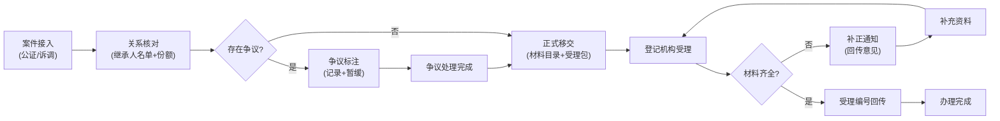

## 1. 产品概述

继承转移案件协同服务平台是面向公证处、调解组织与不动产登记机构的跨部门业务联办系统，通过打通公证继承、诉调确认与不动产登记的业务流程，实现"数据多跑路、群众少跑腿"，重点解决群众重复填报、前置环节与正式登记衔接不畅的问题。

- **核心目标**：整合公证继承与诉调确认两类案件来源，实现继承转移登记的全流程协同办理
- **目标用户**：公证处工作人员、人民调解组织、不动产登记中心经办人员、县区级联办管理人员
- **产品价值**：减少群众重复提交材料、压缩办理时限、提升跨部门协同效率、规范联办业务标准

## 2. 核心功能

### 2.1 用户角色

| 角色 | 登录方式 | 核心权限 |
|------|----------|----------|
| 公证处用户 | 账号密码/政务通 | 案件接入、关系核对、材料上传、状态查询 |
| 调解组织用户 | 账号密码/政务通 | 案件接入、关系核对、争议标注、状态查询 |
| 登记机构用户 | 账号密码/政务通 | 正式受理、材料审核、状态回传、补正通知 |
| 联办管理员 | 账号密码 | 全量查看、统计分析、超期督办、系统配置 |

### 2.2 功能模块

1. **案件接入模块**：登记公证继承与诉调确认两类来源案件，归并同一被继承人的重复申请
2. **关系核对模块**：维护继承人名单与份额说明，标注放弃继承声明，上传遗嘱/公证书摘要
3. **争议标注模块**：记录争议未结和暂缓情形，跟踪争议处理进展
4. **正式移交模块**：生成移交材料目录，向登记机构推送标准化受理包
5. **状态回传模块**：回传受理编号和补正意见，通知前置机构补充资料
6. **查询统计模块**：跨部门办理进展查询，联办统计和超期提醒

### 2.3 页面详情

| 页面名称 | 模块名称 | 功能描述 |
|----------|----------|----------|
| 工作台首页 | 总览 | 待办事项、案件统计、超期提醒、快捷入口 |
| 案件列表页 | 案件接入 | 案件列表、筛选查询、新增案件、归并申请 |
| 案件详情页 | 关系核对 | 被继承人信息、继承人名单、继承份额、材料附件 |
| 争议处理页 | 争议标注 | 争议记录、暂缓情形、处理进展、备注信息 |
| 移交代办页 | 正式移交 | 待移交案件、材料目录生成、标准化受理包推送 |
| 登记受理页 | 状态回传 | 受理登记、补正意见、受理编号回传、补充通知 |
| 统计分析页 | 查询统计 | 联办统计报表、超期预警、办理时限分析 |
| 案件查询页 | 查询统计 | 跨部门办理进展查询、案件追踪 |

## 3. 核心流程

### 3.1 公证继承办理流程

公证处受理继承公证 → 录入案件信息 → 核对继承人关系 → 上传公证书摘要 → 生成移交材料目录 → 推送至登记机构 → 登记机构受理/补正 → 回传受理结果

### 3.2 诉调确认办理流程

调解组织受理继承纠纷 → 录入调解案件 → 核对继承人关系 → 标注争议情况 → 达成调解协议 → 生成移交材料目录 → 推送至登记机构 → 登记机构受理/补正 → 回传受理结果

### 3.3 业务流程图

## 4. 用户界面设计

### 4.1 设计风格

- **主色调**：政务蓝 (#1e40af)，体现政府服务的专业与稳重
- **辅助色**：警示橙 (#f59e0b) 用于超期提醒，成功绿 (#059669) 用于完成状态，中性灰 (#64748b) 用于辅助文字
- **按钮风格**：圆角矩形 (6px)，主按钮填充色，次按钮描边样式，悬停有微动效
- **字体**：系统中文默认字体 (PingFang SC / Microsoft YaHei)，数字与英文使用 Inter 字体
- **布局风格**：左侧导航 + 顶部状态栏 + 主内容区的经典政务后台布局
- **图标风格**：线性图标 (lucide-react)，统一线条粗细 2px

### 4.2 页面设计概览

| 页面名称 | 模块名称 | UI元素 |
|----------|----------|--------|
| 工作台首页 | 总览 | 顶部数据卡片(4项统计)、左侧导航、待办列表、超期预警卡片、快捷操作区 |
| 案件列表页 | 案件接入 | 顶部筛选栏、表格列表、操作列、新增按钮、归并操作弹窗 |
| 案件详情页 | 关系核对 | 分栏布局(左侧案件信息、右侧继承人列表)、标签页切换、材料上传区 |
| 争议处理页 | 争议标注 | 时间线布局、争议类型标签、暂缓开关、处理记录列表 |
| 移交代办页 | 正式移交 | 两栏布局(待移交列表 + 材料预览)、生成目录按钮、推送确认弹窗 |
| 登记受理页 | 状态回传 | 受理表单、补正意见编辑器、材料清单勾选、受理回传按钮 |
| 统计分析页 | 查询统计 | 图表区(柱状图+饼图)、筛选条件、数据表格、导出按钮 |
| 案件查询页 | 查询统计 | 搜索框、时间筛选、案件卡片列表、进度追踪条 |

### 4.3 响应式设计

- 桌面端优先设计，以 1440px 为基准宽度
- 左侧导航在平板端可折叠为图标模式
- 表格支持横向滚动，适配小屏设备
- 弹窗最大宽度自适应，最小 320px
- 触控目标最小尺寸 44px × 44px

### 4.4 交互与动效

- 页面切换：淡入淡出过渡 (150ms ease)
- 列表加载：骨架屏占位 + 渐入效果
- 按钮交互：悬停背景色变化 + 轻微上浮
- 状态流转：进度条动画 + 步骤高亮
- 超期提醒：脉冲动画吸引注意
- 表单验证：实时校验，错误提示平滑出现
