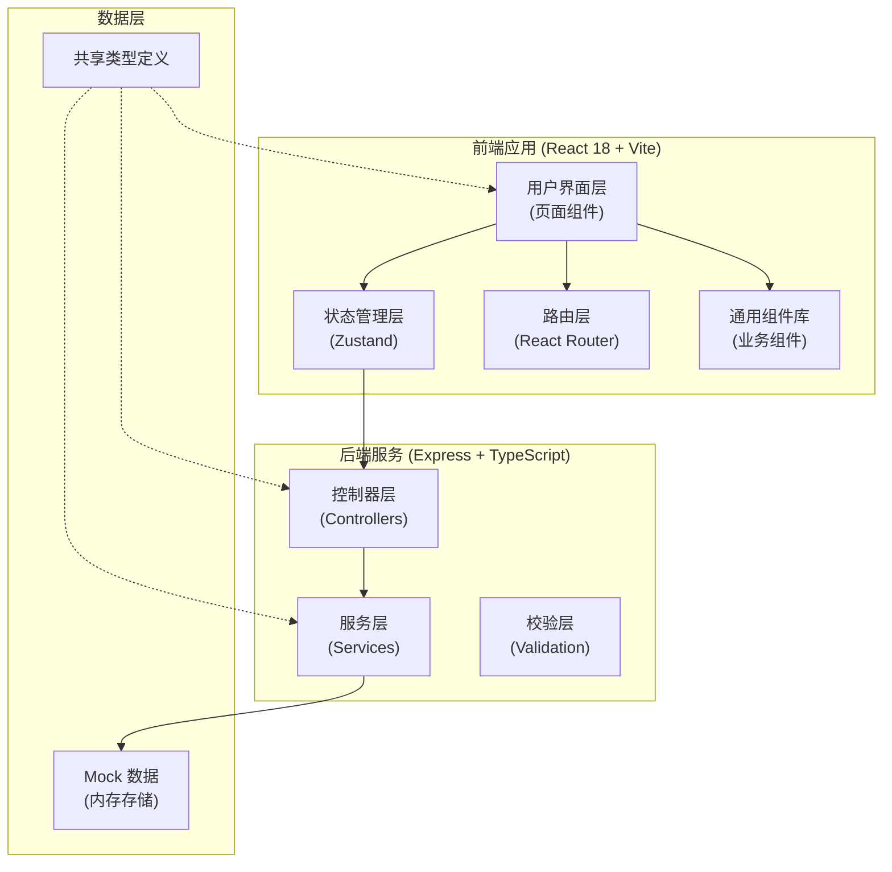
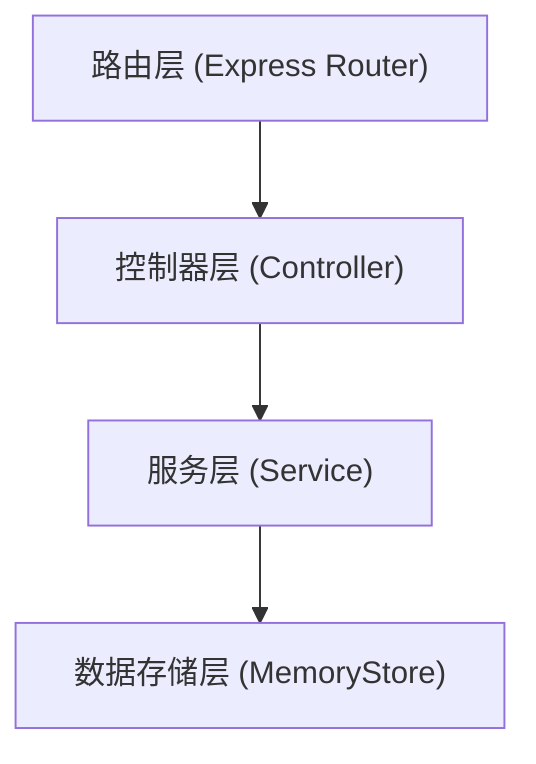
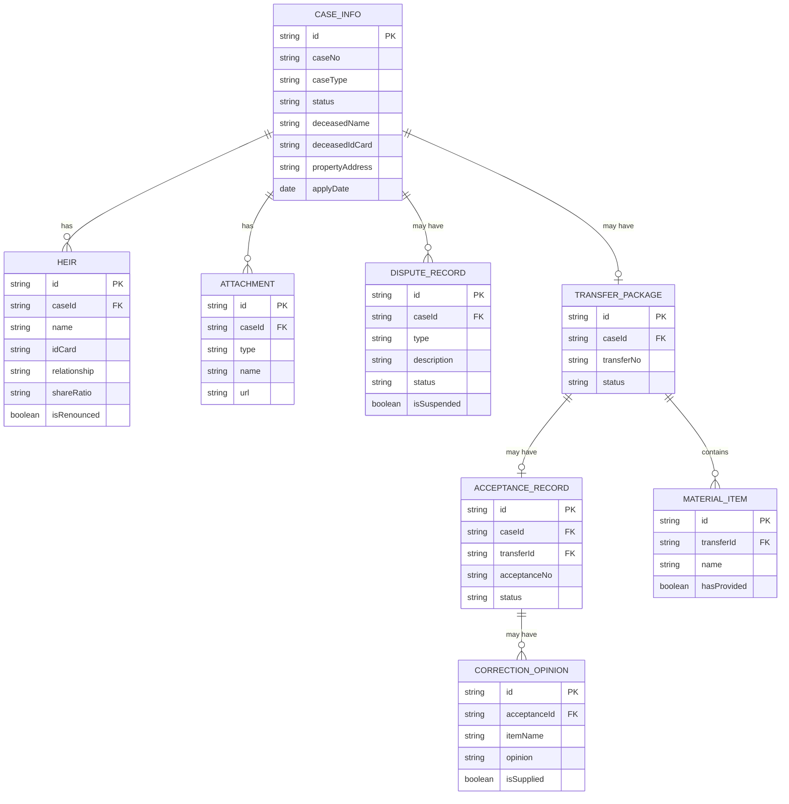

## 1. 架构设计



## 2. 技术描述

- **前端框架**：React 18 + TypeScript
- **构建工具**：Vite 5.x
- **样式方案**：TailwindCSS 3.x
- **状态管理**：Zustand
- **路由管理**：React Router v6
- **图标库**：lucide-react
- **后端框架**：Express 4 + TypeScript
- **数据存储**：内存 Mock 数据（演示用途）
- **代码规范**：ESLint + Prettier

## 3. 路由定义

| 路由路径 | 页面名称 | 模块 | 说明 |
|----------|----------|------|------|
| `/` | 工作台首页 | 总览 | 待办、统计、超期提醒 |
| `/cases` | 案件列表 | 案件接入 | 案件查询、新增、归并 |
| `/cases/:id` | 案件详情 | 关系核对 | 被继承人、继承人、材料 |
| `/cases/:id/dispute` | 争议处理 | 争议标注 | 争议记录、暂缓情形 |
| `/transfer` | 移交代办 | 正式移交 | 待移交、材料目录、推送 |
| `/acceptance` | 登记受理 | 状态回传 | 受理登记、补正回传 |
| `/statistics` | 统计分析 | 查询统计 | 联办统计、超期预警 |
| `/search` | 案件查询 | 查询统计 | 跨部门进展查询 |

## 4. API 定义

### 4.1 案件相关

```typescript
// 案件信息类型
interface CaseInfo {
  id: string;
  caseNo: string;
  caseType: 'notary' | 'mediation';
  source: string;
  status: CaseStatus;
  deceasedName: string;
  deceasedIdCard: string;
  deceasedDate: string;
  propertyAddress: string;
  propertyArea: number;
  applyDate: string;
  handler: string;
  remark?: string;
  createdAt: string;
  updatedAt: string;
}

type CaseStatus = 
  | 'pending'      // 待核对
  | 'verified'     // 已核对
  | 'disputed'     // 争议中
  | 'transferring' // 待移交
  | 'transferred'  // 已移交
  | 'accepted'     // 已受理
  | 'correction'   // 需补正
  | 'completed';   // 已完成

// 继承人类型
interface Heir {
  id: string;
  caseId: string;
  name: string;
  idCard: string;
  relationship: string;
  phone: string;
  shareRatio: string;
  isRenounced: boolean;
  renounceDocUrl?: string;
  remark?: string;
  order: number;
}

// 材料附件类型
interface Attachment {
  id: string;
  caseId: string;
  type: AttachmentType;
  name: string;
  url: string;
  size: number;
  uploadedBy: string;
  uploadedAt: string;
}

type AttachmentType = 
  | 'death_cert'     // 死亡证明
  | 'will'           // 遗嘱
  | 'notarial_cert'  // 公证书
  | 'mediation_agreement' // 调解协议
  | 'renounce_declaration' // 放弃声明
  | 'property_cert'  // 产权证明
  | 'id_card'        // 身份证明
  | 'other';         // 其他材料
```

### 4.2 争议相关

```typescript
interface DisputeRecord {
  id: string;
  caseId: string;
  type: DisputeType;
  description: string;
  status: 'pending' | 'processing' | 'resolved';
  isSuspended: boolean;
  suspendReason?: string;
  handler: string;
  createdAt: string;
  updatedAt: string;
}

type DisputeType = 
  | 'heir_dispute'      // 继承人争议
  | 'share_dispute'     // 份额争议
  | 'will_dispute'      // 遗嘱争议
  | 'property_dispute'  // 产权争议
  | 'other';            // 其他争议
```

### 4.3 移交与受理相关

```typescript
interface TransferPackage {
  id: string;
  caseId: string;
  transferNo: string;
  materialCatalog: MaterialItem[];
  transferredBy: string;
  transferredAt: string;
  status: 'pending' | 'sent' | 'received';
}

interface MaterialItem {
  id: string;
  name: string;
  type: string;
  count: number;
  isRequired: boolean;
  hasProvided: boolean;
  remark?: string;
}

interface AcceptanceRecord {
  id: string;
  caseId: string;
  transferId: string;
  acceptanceNo: string;
  acceptedBy: string;
  acceptedAt: string;
  status: 'accepted' | 'correction' | 'completed';
  correctionOpinions?: CorrectionOpinion[];
}

interface CorrectionOpinion {
  id: string;
  itemName: string;
  opinion: string;
  isSupplied: boolean;
  suppliedAt?: string;
}
```

### 4.4 API 端点列表

| 方法 | 路径 | 说明 |
|------|------|------|
| GET | `/api/cases` | 获取案件列表（支持筛选） |
| GET | `/api/cases/:id` | 获取案件详情 |
| POST | `/api/cases` | 新增案件 |
| PUT | `/api/cases/:id` | 更新案件信息 |
| GET | `/api/cases/:id/heirs` | 获取继承人列表 |
| POST | `/api/cases/:id/heirs` | 添加继承人 |
| PUT | `/api/heirs/:id` | 更新继承人信息 |
| DELETE | `/api/heirs/:id` | 删除继承人 |
| GET | `/api/cases/:id/attachments` | 获取材料附件列表 |
| POST | `/api/cases/:id/attachments` | 上传材料附件 |
| GET | `/api/cases/:id/disputes` | 获取争议记录 |
| POST | `/api/cases/:id/disputes` | 新增争议记录 |
| PUT | `/api/disputes/:id` | 更新争议状态 |
| POST | `/api/transfers/generate` | 生成移交材料目录 |
| POST | `/api/transfers` | 推送移交受理包 |
| GET | `/api/transfers/pending` | 获取待移交列表 |
| POST | `/api/acceptances` | 登记受理 |
| PUT | `/api/acceptances/:id/correction` | 提交补正意见 |
| POST | `/api/acceptances/:id/supplement` | 补充材料确认 |
| GET | `/api/statistics/summary` | 获取统计汇总数据 |
| GET | `/api/statistics/overdue` | 获取超期案件列表 |
| GET | `/api/search` | 案件跨部门查询 |

## 5. 服务层架构



- **路由层**：定义 API 端点，请求分发
- **控制器层**：参数校验、响应格式化、错误处理
- **服务层**：业务逻辑处理、数据转换、流程编排
- **数据层**：内存数据存储、CRUD 操作

## 6. 数据模型

### 6.1 ER 图



### 6.2 数据字典

**案件状态枚举**：
| 值 | 说明 | 可流转至 |
|----|------|----------|
| pending | 待核对 | verified, disputed |
| verified | 已核对 | transferring, disputed |
| disputed | 争议中 | verified, transferring |
| transferring | 待移交 | transferred |
| transferred | 已移交 | accepted, correction |
| accepted | 已受理 | completed |
| correction | 需补正 | transferred |
| completed | 已完成 | - |

**案件来源类型**：
| 值 | 说明 |
|----|------|
| notary | 公证继承 |
| mediation | 诉调确认 |

## 7. 前端目录结构

```
src/
├── components/          # 通用组件
│   ├── Layout/         # 布局组件
│   ├── StatusBadge/    # 状态标签
│   ├── CaseCard/       # 案件卡片
│   ├── HeirTable/      # 继承人表格
│   └── FileUpload/     # 文件上传
├── pages/              # 页面组件
│   ├── Dashboard/      # 工作台
│   ├── CaseList/       # 案件列表
│   ├── CaseDetail/     # 案件详情
│   ├── Dispute/        # 争议处理
│   ├── Transfer/       # 正式移交
│   ├── Acceptance/     # 登记受理
│   ├── Statistics/     # 统计分析
│   └── Search/         # 案件查询
├── store/              # Zustand 状态
│   ├── useCaseStore.ts
│   └── useAuthStore.ts
├── hooks/              # 自定义 Hooks
│   ├── useCases.ts
│   └── useStatistics.ts
├── utils/              # 工具函数
│   ├── format.ts
│   └── validators.ts
├── types/              # 类型定义
│   └── index.ts
├── services/           # API 服务
│   └── api.ts
├── App.tsx
├── main.tsx
└── index.css
```
